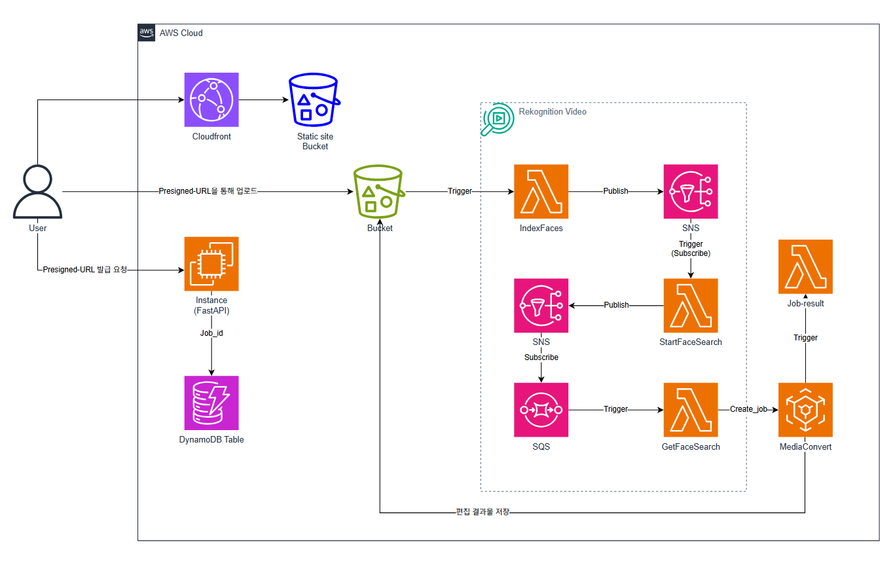

# FocusOnYou

Automatic Person Tracking Video Service  
[Project Description](https://omoknooni.tistory.com/78)

## Architecture


## Requirement
- AWS CLI
- >= Terraform v1.11
- >= nodejs v22.12

## Install
```bash
# install package python3-venv
sudo apt install python3-venv

# Setting python virtual env
python3 -m venv focusonyou-env

# Install pip requirements
pip3 install -r requirements.txt

```

## Deploy
Terraform을 사용해서 deploy 가능

### 1. 백엔드 API 서버 + 미디어 버킷 등 AWS 리소스 프로비저닝  
deploy의 terraform code에 따라 프로비저닝 (with Terraform Cloud)  
정적호스팅 버킷의 이름은 미리 지정해둠  
### 2. 정적호스팅 버킷을 위한 프론트엔드 react 빌드  
미리 지정해둔 정적호스팅 버킷명(Terraform의 output이기도함)을 비롯한 정보들을 frontend/.env에 지정 후 빌드  